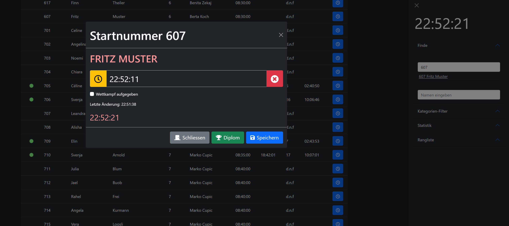

# Chronometry-bundle
Zeiterfassungs Tool für Ausdauerwettkämpfe programmiert für die Schule Ettiswil. Die App basiert auf dem Javascript Framework [vue.js](https://vuejs.org/) und kann lokal auf xampp ausgeführt werden. Alle Ressourcen* sind lokal im public-Verzeichnis des Moduls vorhanden.

### CSV
Im Verzeichnis "docs" befindet sich eine Beispiel-CSV-Datei, welche zum Aufbau der Datenbank benutzt werden kann. Die Datei lässt sich dann mit [markocupic/import-from-csv-bundle](https://github.com/markocupic/import-from-csv-bundle) in die Datenbank (tl_chronometry) einlesen.

### Seitentemplate
Neben dem Modul-Verzeichnis gibt es in src/Resources/contao/templates/frontend/fe_page_chronometry.html5 ein Seitentemplate, welches bereits für Bootstrap vorbereitet ist.

### Diplom
Über das Modalfenster kann anlässlich einer Siegerehrung ein Diplom (MS-Word-Dokument) ausgedruckt werden.

### Abhängigkeiten
Diese Ressourcen werden im Template eingebunden und befinden sich in src/Resources/public
* vue.js
* Font Awesome 5 Free
* Bootstrap Framework
* jQuery (muss im Theme im Contao Backend eingebunden werden)
* popper.js
* [stupid-table table sorter](https://github.com/joequery/Stupid-Table-Plugin)

### XAMPP & Installation

#### XAMPP installieren in c:\xampp

#### php.ini anpassen
```
memory_limit=-1 # kein Limit

extension=intl # aktivieren
extension=gd # aktivieren
extension=fileinfo # aktivieren
extension=sodium # aktivieren
```

#### Konfiguration für virtuellen Host in C:\xampp\apache\conf\extra\httpd-vhosts.conf
```
<VirtualHost *:80>
    DocumentRoot "C:/xampp/htdocs/"
    ServerName localhost
    <Directory "C:/xampp/htdocs/">
	AllowOverride All
	Allow from All
    </Directory>
</VirtualHost>

<VirtualHost *:80>
    ServerName duathlon.local
    DocumentRoot "C:/xampp/htdocs/duathlon/web"
    ErrorLog "logs/duathlon-error.log"
    CustomLog "logs/duathlon-access.log" common
    <Directory "C:/xampp/htdocs/duathlon/web">
	AllowOverride All
	Allow from All
    </Directory>
</VirtualHost>

```

#### Konfiguration von C:\Windows\System32\drivers\etc\hosts
```
127.0.0.1      duathlon.local
```

#### Tipp: XAMPP unbedingt im "Als Administrator ausführen" Modus neu starten.

#### In phpmyadmin eine Datenbank anlegen.

#### Contao lokal installieren mit composer oder per http://duathlon.local/contao-manager.phar.php

#### Zusatzmodule installieren

```
require markocupic/chronometry-bundle
require markocupic/export_table
require markocupic/import-from-csv-bundle
```

#### Contao Setup
- In Contao anmelden `http://duathlon.local/contao`.
- Ein Theme erstellen und darin ein Layout einbauen (einspaltig ohne Kopf- und Fusszeile, jQuery aktivieren)
- Das Zeitmessungsmodul erstellen
- Eine Seite erstellen und darin das Modul einbinden
- Mit `markocupic/import-from-csv-bundle` die Startliste in tl_chronometry importieren
- Für Tabellenexport `markocupic/export_table` benutzen (Datumsfelder werden automatisch von Unix nach d.m.Y konvertiert)


