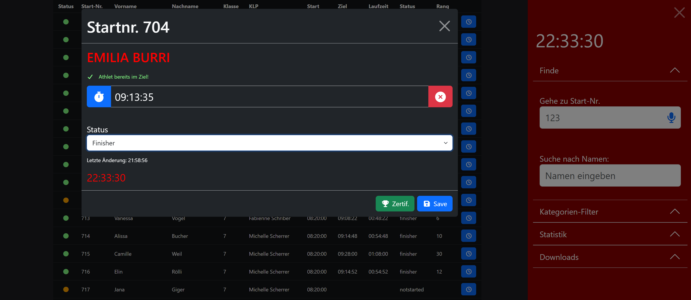

# Chronometry-bundle
Zeiterfassungs Tool für Ausdauerwettkämpfe programmiert für die Schule Ettiswil. Die App basiert auf dem Javascript Framework [vue.js](https://vuejs.org/) und kann lokal auf xampp ausgeführt werden. Alle Ressourcen* sind lokal im public-Verzeichnis des Moduls vorhanden.

### CSV
Im Verzeichnis "docs" befindet sich eine Beispiel-CSV-Datei, welche zum Aufbau der Datenbank benutzt werden kann. Die Datei lässt sich dann mit [markocupic/import-from-csv-bundle](https://github.com/markocupic/import-from-csv-bundle) in die Datenbank (tl_chronometry) einlesen.

### Seitentemplate
Neben dem Modul-Verzeichnis gibt es in contao/templates/frontend/fe_page_chronometry.html5 ein Seitentemplate, welches bereits für Bootstrap vorbereitet ist.

### Diplom
Über das Modalfenster kann anlässlich einer Siegerehrung ein Diplom (MS-Word-Dokument) ausgedruckt werden.

### Abhängigkeiten
Diese Abhängigkeiten werden atomatisch mitinstalliert
* vue.js
* Font Awesome 7 Free
* Bootstrap Framework
* [tofsjonas/sortable](https://github.com/tofsjonas/sortable)

### Lokale Installation mit Symfony Server

Soll die App in einem Funkloch betrieben werden, kann die App mit Symfony Server auch lokal auf einem Notebook installiert und betrieben werden.

Es können sogar **mehrere Geräte** auf die Server Instanz zugreifen. Dadurch können bei vielen Teilnehmern mehrere Leute die Zeitmessung im Ziel verarbeiten.

**Konfiguration:**

- Ein Mobiltelefon agiert als Hotspot
- **Notebook** und andere **mobile Geräte** verbinden sich mit dem **Hotspot**. Alle mit dem Hotspot verbundenen Geräte befinden sich nun im gleichen Subnetz.
- Via `ipconfig /all` die IP-Adresse des Notebooks ermitteln. (z.B. 10.247.21.86)
- Danach in der Kommandozeile ins Project Root wechseln.
- Danach am Notebook Symfony Server via CLI starten. `symfony server:start --allow-all-ip --port=8000`
- Oder besser die Datei `start_symfony_server.ps1` ins Project Root kopieren und `./start_symfony_server.ps1` in der CLI ausführen.
- Alle mit dem via Hotspot verbundenen Geräte können auf die Server Instanz zugreifen, weil sie im selben Subnetz sind.
- Im Browser die IP-Adresse des Notebooks eingeben. (z.B. http://10.247.21.86:8000)

#### Contao Setup
- In Contao anmelden `http://duathlon.local/contao`.
- Ein Theme erstellen und darin ein Layout einbauen (einspaltig ohne Kopf- und Fusszeile)
- Das Zeitmessungsmodul erstellen
- Eine Seite erstellen und darin das Modul einbinden
- Mit `markocupic/import-from-csv-bundle` die Startliste in tl_chronometry importieren
- Für Tabellenexport `markocupic/export_table` benutzen (Datumsfelder werden automatisch von Unix nach d.m.Y konvertiert)
